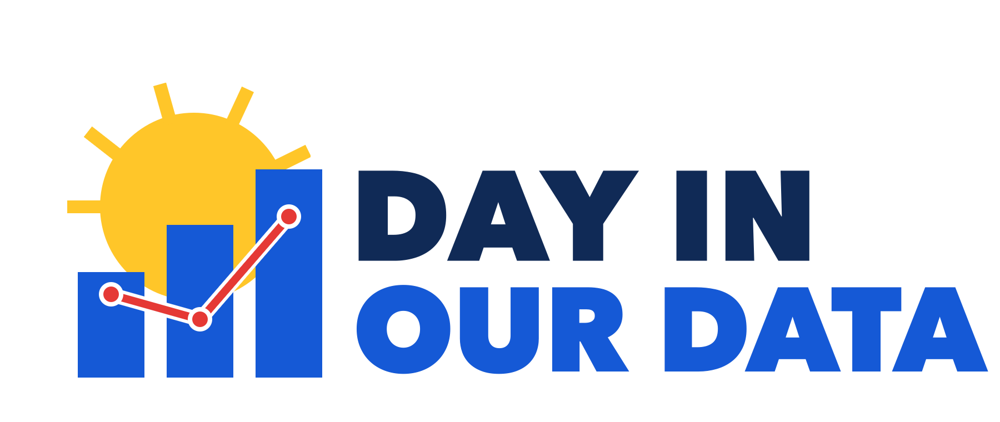

# Day in Our Data

Oak Park residents are invited to Day in Our Data, a one day civic hackathon sponsored by the Village of Oak Park's Civic Information Systems Commission (CISC). Participants will explore Village data, working in teams to create useful tools, websites, maps and visualizations. Potential projects include mapping safe biking routes to schools, finding patterns in crime data, or visualizing changes in Oak Park housing affordability. The event is for anyone interested in local government, technology, data, or community problem solving. Coding is optional: every starter project has work for people who never touch a keyboard.

## When, where, register

- **When:** Saturday, October 3, 2026, 11 a.m. to 3 p.m.
- **Where:** Meeting room, Dole Branch Library, Oak Park Public Library, 255 Augusta St., Oak Park, IL
- **Register:** https://oak-park.us/ciscdata (free; pizza and snacks provided)

## How the day works

1. Organizers introduce each starter project in about a minute, and you pick a table.
2. Teams work in two blocks, with a food break in between.
3. Each team gives a short demo at the end.
4. After the event, CISC publishes a showcase of what every team produced. Participants vote on their favorites from the showcase, and the top teams get gift cards and an invitation to present at a later CISC meeting.

You do not need to finish an app in four hours. A map, a chart, a cleaned dataset, a small prototype, or a well-documented question is a good result. You can also bring your own project, as long as it uses public data.

Full schedule and ground rules: [event-program.md](event-program.md).

## Pick a project

Fourteen organizer-seeded briefs are ready to go, each with a clear question, data already cached in this repo, a quick first win, and a no-code lane. See the [starter projects index](starter-projects/README.md), or pitch your own with the [pitch-your-own template](starter-projects/00-pitch-your-own.md).

1. [Is my assessment fair?](starter-projects/01-is-my-assessment-fair.md) Compare assessed value per square foot across every Oak Park home.
2. [Where does my tax dollar go?](starter-projects/02-where-does-my-tax-dollar-go.md) Twenty years of levies from six taxing agencies, adjusted for inflation.
3. [Can a kid bike to school safely?](starter-projects/03-can-a-kid-bike-to-school-safely.md) Map the bike network against school routes and crash records.
4. [Oak Park over time](starter-projects/04-oak-park-over-time.md) Census data on how the village is changing, compared with county and state.
5. [What do our commissions do?](starter-projects/05-what-do-our-commissions-do.md) Build the "find your commission" tool that does not exist yet.
6. [How are our schools doing?](starter-projects/06-how-are-our-schools-doing.md) Illinois Report Card: D97 and D200 versus peers, over time.
7. [Oak Park crime data explorer](starter-projects/07-oak-park-crime-explorer.md) What incident data shows about what happens where and when.
8. [How resilient is our urban forest?](starter-projects/08-how-resilient-is-our-urban-forest.md) 18,800 public trees against the 10-20-30 diversity rule.
9. [Are the worst alleys getting fixed?](starter-projects/09-are-the-worst-alleys-getting-fixed.md) Alley condition ratings versus the reconstruction plan.
10. [Which bus stops need help?](starter-projects/10-which-bus-stops-need-help.md) Shelter, ridership, and who lives nearby, for every stop.
11. [Build an architecture walking tour](starter-projects/11-build-an-architecture-walking-tour.md) 4,958 surveyed historic buildings by architect, style, or street.
12. [Can I park here right now?](starter-projects/12-can-i-park-here-right-now.md) An address-plus-time answer from the Village's curb restriction data.
13. [Where is business activity changing?](starter-projects/13-where-is-business-activity-changing.md) Openings and closings by corridor from 2,519 business licenses.
14. [What does ECHO see?](starter-projects/14-what-does-echo-see.md) What the Village's non-police response team handles, in aggregate.

## Data

The [Oak Park Civic Data Catalog](data/open-data-catalog.md) lists more than 70 Village, Cook County, state, regional, and federal data sources by category, with links, format notes, and the filters that narrow each source to Oak Park. The [commissions dataset](commissions-diod.csv) covers every Oak Park citizen commission: what it does, where and when it meets, and where to learn more.

## More project ideas

- [Project ideas](project-ideas.md): the sixteen-challenge idea list the briefs grew from, with data links and readiness labels. Most are ready to run as a pitch-your-own table.

## Contributing

Pull requests are welcome: fix a broken link, add a data source to the catalog, improve a brief, or share what your team built. Everything here is released under the [MIT License](LICENSE).

Questions about the event? Contact the Civic Information Systems Commission through the Village of Oak Park at https://www.oak-park.us.
