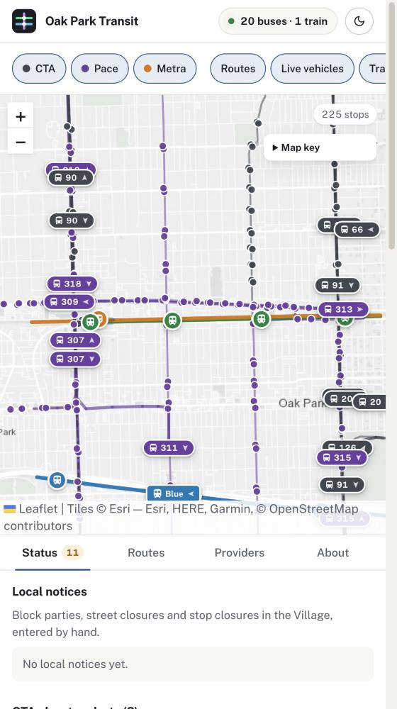
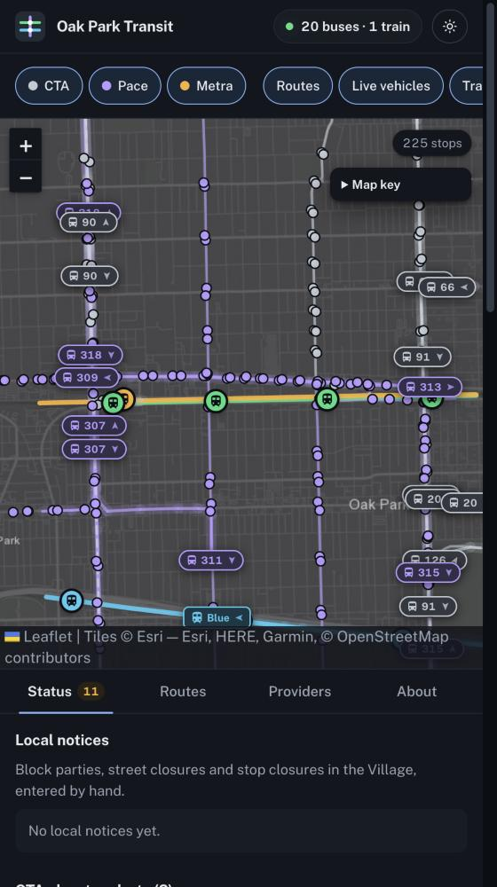

# Oak Park Transit Tracker

One page for Oak Park residents that shows transit stops, routes, accessibility, service alerts and transportation providers. Built at [Day in Our Data](https://github.com/oak-park-cisc/Oak_Park_Day_in_our_Data), October 3, 2026, from starter project [08: Build the Oak Park transit dashboard](https://github.com/oak-park-cisc/Oak_Park_Day_in_our_Data/blob/main/starter-projects/08-build-the-oak-park-transit-dashboard.md).

**Live site:** https://captainchemist.github.io/oak-park-transit-tracker/ · [QR code to share](https://captainchemist.github.io/oak-park-transit-tracker/qr.html)

<p>
  
  
</p>

## What it does

- **Live buses and trains.** CTA and Pace buses and CTA Green and Blue Line trains near Oak Park, updated every 30 seconds, with fading trails of the last 15 minutes.
- **Next arrivals.** Click a CTA station or bus stop to see the next trains or buses in each direction.
- **Accessibility.** Color stops by wheelchair boarding. Unknown is shown as unknown, never as inaccessible.
- **Service status.** CTA elevator outages and service alerts for the lines serving Oak Park, plus hand-entered local notices.
- **Routes.** Service hours and trips per hour for every route.
- **Who to call.** A guide to CTA, Pace, Metra, Pace ADA Paratransit and Township Senior Services rides.
- **Day and night maps.** Night mode shows the trails glowing on a dark map.

Built by Stephen Jensen and Cody MacNeil.

## Run locally

```bash
npm install
npm run dev
```

Open http://localhost:5173/oak-park-transit-tracker/

Every push to `main` deploys to GitHub Pages in about a minute. The deploy also re-runs every 15 minutes to refresh CTA alerts.

## Where things live

| Path | What |
|---|---|
| `src/MapView.jsx` | Leaflet map, stop markers and popups, route lines |
| `src/StatusPanel.jsx` | Local notices + CTA elevator and service alerts |
| `src/ProviderGuide.jsx` | Provider cards |
| `src/content/providers.json` | **Edit without code:** provider guide rows |
| `src/content/notices.json` | **Edit without code:** block parties, closures |
| `public/data/` | Stops CSV, prebuilt route lines, latest alerts |
| `scripts/build_routes.py` | Rebuilds `routes.geojson` from CTA, Pace and Metra GTFS zips |
| `src/RoutesPanel.jsx` | Routes tab and route mode: one route's hours and trips-per-hour charts |
| `src/travel.js`, `src/TravelPanel.jsx`, `src/TravelLayer.jsx` | Travel tab: in-browser travel-time estimates (walk + wait + ride), heat maps and trip legs |
| `scripts/build_travel.py` | Rebuilds `travel.json` (compact timetable, 100 m Village grid, street-network walking times) from the same GTFS zips plus an OpenStreetMap walkable-ways extract (Overpass query in the script) |
| `scripts/build_service.py` | Rebuilds `route-service.json` (first/last trip, trips per hour at Village stops) from the same GTFS zips |
| `scripts/build_boundary.py` | Rebuilds `boundary.geojson` (Village outline + 1/4-mile fade) from Census TIGERweb |
| `scripts/fetch_alerts.py` | Pulls active CTA alerts that touch Oak Park routes and stations |

### Adding a local notice

Add an object to `src/content/notices.json`:

```json
{
  "type": "Block party",
  "title": "Short title",
  "location": "Street and block",
  "dates": "Oct 10, 2-8 p.m.",
  "source": "https://link-to-where-you-found-it"
}
```

### Checking a provider row

After you check a row against the provider's page, set `"verified": true` and `"checkedOn": "2026-10-03"` in `providers.json`. Until then the card shows an "unverified" tag.

## Live buses and trains

`worker/` is a Cloudflare Worker that returns live positions for the Oak Park CTA and Pace bus routes and the CTA Green and Blue Lines. CTA buses come from the Bus Tracker API (`CTA_BUS_KEY` worker secret) and CTA trains from the Train Tracker API (`CTA_TRAIN_KEY` worker secret). Pace has no official real-time API, so it uses the undocumented JSON behind Pace's [Bus Tracker](https://tmweb.pacebus.com/TMWebWatch/), adds CORS headers, and caches for 20 seconds. If it's down, the map shows a saved sample in gray, labeled as not live.

```bash
cd worker && npm install
npx wrangler dev      # local, at http://localhost:8787/vehicles (put CTA_BUS_KEY=... and CTA_TRAIN_KEY=... in worker/.dev.vars)
npx wrangler deploy   # needs `npx wrangler login` first
```

After deploying, set the repo variable `BUS_PROXY_URL` to the worker URL (no trailing slash) and re-run the Pages deploy.

## Data and limits

- Stops come from the Day in Our Data snapshot (`transit-stops-oak-park.csv`), not a live schedule.
- `weekday_trips` counts a single weekday (September 9, 2026). It isn't a headway.
- Pace stop accessibility isn't recorded, so the map shows it as **Unknown**, not inaccessible.
- CTA alerts come from the [Customer Alerts API](https://www.transitchicago.com/developers/alerts/). Pace and Metra alerts aren't included yet.
