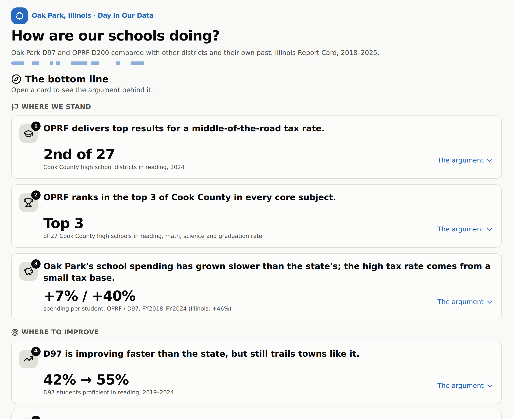
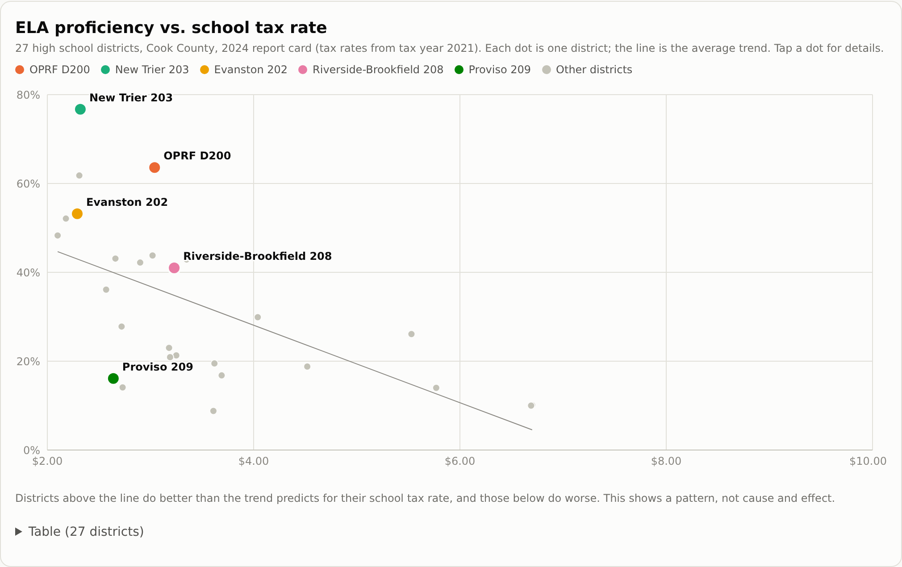
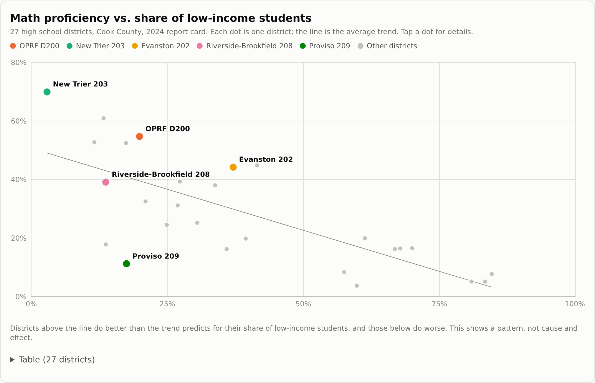
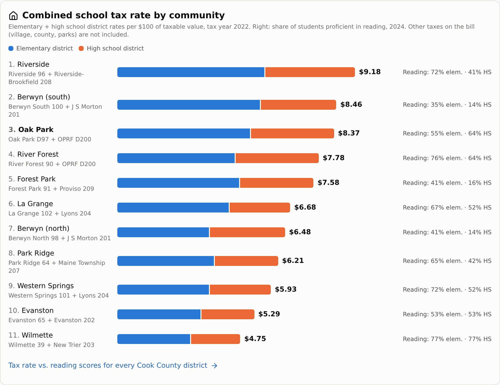
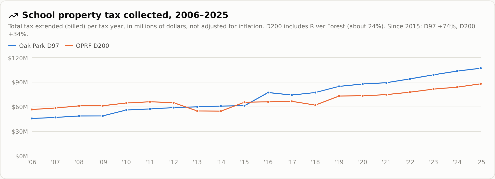
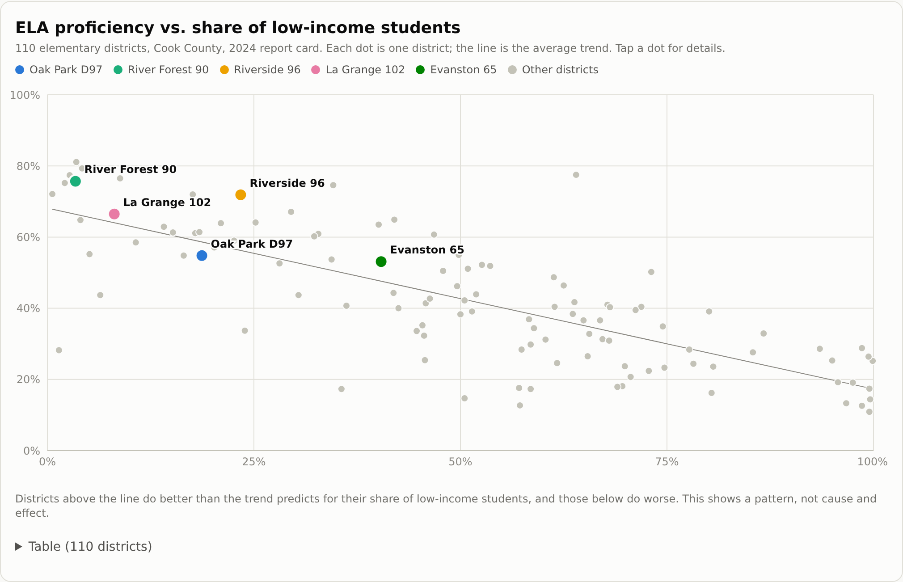
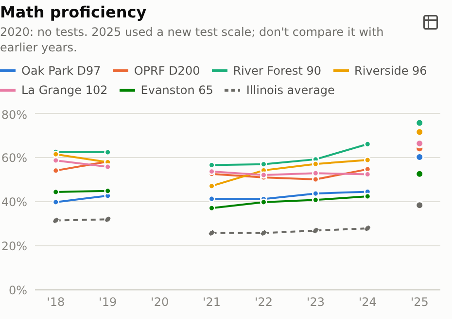
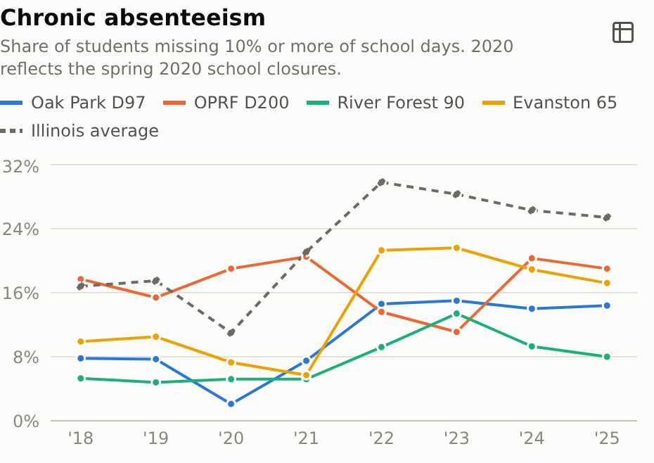

# How are our schools doing?

**Oak Park D97 and OPRF D200, compared with peer districts and their own past**

Illinois Report Card data, 2018–2025, for every Illinois district, plus Cook County Clerk tax data.

---

## The bottom line

**Where we stand**
1. OPRF delivers top results for a middle-of-the-road tax rate.
2. OPRF ranks in the top 3 of Cook County in every core subject.
3. Oak Park's school spending has grown slower than the state's; the high tax rate comes from a small tax base.

**Where to improve**
4. D97 is improving faster than the state, but still trails towns like it.
5. D97 math has barely moved while reading took off.
6. Chronic absenteeism has nearly doubled in D97.

---

## 1. OPRF: top results for a middle-of-the-road tax rate

- **2nd of 27** Cook County high school districts in reading proficiency (2024); only New Trier is higher.
- About **20 points above** what its share of low-income students predicts.
- School tax rate **$3.04** per $100, near the Cook County median ($3.18). All 14 districts with a higher
  rate score lower in reading. Graduation rate **97%** (Illinois: 89%).

*But:* OPRF has fewer low-income students (20%) than most Cook County high schools (median 34%), which tends to lift scores. It still scores well above the trend for its share.

---

## 2. OPRF ranks in the top 3 of Cook County in every core subject

Among 27 Cook County high school districts:

| Measure | OPRF | Illinois | Rank |
| --- | --- | --- | --- |
| Reading (2024) | 64% | 39% | 2nd |
| Math (2024) | 55% | 28% | 3rd |
| Science (2024) | 72% | 53% | 3rd |
| Graduation rate (2025) | 97% | 89% | 3rd |

Low-income students' reading: 32%, 2nd of 27 (Illinois: 25%).

*But:* low-income students' math ranks lower, 7th of 24 (20% proficient).

---

## 3. Spending has grown slower than the state's; the high rate comes from a small tax base

| Spending per student | FY2018 | FY2024 | Change |
| --- | --- | --- | --- |
| OPRF D200 | $24,863 | $26,540 | **+7%** |
| D97 | $14,422 | $20,214 | **+40%** |
| Illinois average | | | +46% |

- D97 spends near the Cook County median (56th of 114) and puts 59% into instruction (Cook County median: 57%).
- The combined school tax rate is still high, **$8.37** per $100 (3rd of 11 nearby towns; Evanston: $5.29),
  because D97 has $353,673 of taxable property per student vs. $711,837 in Evanston 65, and the state pays only 4%.

---

## School taxes billed, 2006–2025

Since 2015: D97 **+74%**, D200 **+34%** (Cook County Clerk; not adjusted for inflation).

*A rate is not a bill: home values and exemptions decide what each household pays.*

---

## 4. D97 is improving, but still trails towns like it

- Reading proficiency **42% → 55%** (2019–2024); the state rose 2 points.
- Yet **22nd of 25** Cook County districts with 25% or fewer low-income students. River Forest 90: 76%.

---

## 5. D97 math has barely moved while reading took off

- Math **43% → 45%** proficient (2019–2024); reading rose 13 points over the same years.
- 16th of 25 Cook County districts with 25% or fewer low-income students. River Forest 90: 66%.

*But:* Illinois math fell 4 points over the same years, so D97 still climbed from 42nd to 28th in Cook County.

---

## 6. Chronic absenteeism has nearly doubled in D97

- **8% → 14%** of D97 students missed 10% or more of school days (2019–2025).
- OPRF: 15% → 19%. Both remain below Illinois (25%).

---

## Questions for the school boards

- D97 reading rose 13 points since 2019, but math only 2. What is the plan for math?
- OPRF's instructional spending per student fell ($16,346 → $14,956) while total spending rose. Real shift or accounting change?
- What is behind rising absenteeism, and which schools are most affected?

---

## How to read this

- Test comparisons stop at 2024: 2025 used new performance levels, and high schools moved from the SAT to the ACT.
- No state tests in 2020. Finance figures lag one year.
- These are patterns, not causes. Every number is computed from the data and checked by automated tests.

**Sources:** ISBE Illinois Report Card public data sets, 2018–2025; Cook County Clerk tax extension reports. See `public/data/SOURCES.md`.
